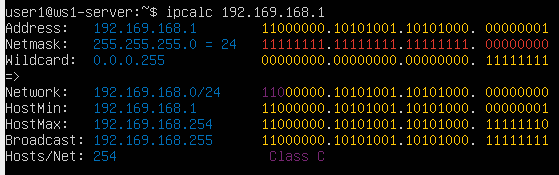
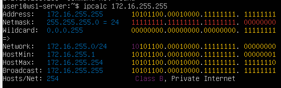
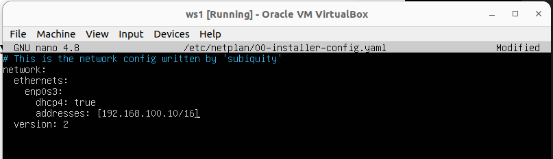
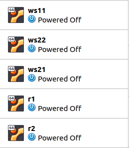

# Сети в Linux

Настройка сетей в Linux на виртуальных машинах.


## Contents

1. [Инструмент ipcalc](#part-1-инструмент-ipcalc)
2. [Статическая маршрутизация между двумя машинами](#part-2-статическая-маршрутизация-между-двумя-машинами)
3. [Утилита iperf3](#part-3-утилита-iperf3)
4. [Сетевой экран](#part-4-сетевой-экран)
5. [Статическая маршрутизация сети](#part-5-статическая-маршрутизация-сети)
6. [Динамическая настройка IP с помощью DHCP](#part-6-динамическая-настройка-ip-с-помощью-dhcp)
7. [NAT](#part-7-nat)
8. [Допополнительно. Знакомство с SSH Tunnels](#part-8-дополнительно-знакомство-с-ssh-tunnels)

## Part 1. Инструмент **ipcalc**
Работа с виртуальной машиной ws1.

#### 1.1. Сети и маски
##### Определить и записать в отчёт:
##### 1) адрес сети *192.167.38.54/13*
Воспользовавшись командой ```ipcalc```, можно опеределить адрес сети в поле Address <br>

 
> *Сетевой адрес* — идентификатор устройства, работающего в компьютерной сети.
##### 2) перевод маски *255.255.255.0* в префиксную и двоичную запись, */15* в обычную и двоичную, *11111111.11111111.11111111.11110000* в обычную и префиксную

> Префиксная запись. Краткий формат записи маски подсети, в котором указывается только количество единичных битов в маске после косой черты.
- Префиксная запись маски *255.255.255.0* в поле Network: ```/24```
- Двоичная запись маски *255.255.255.0* в поле Netmask: ```11111111.11111111.11111111.00000000``` <br>


- */15* в обычной записи в поле Netmask: ```255.254.0.0```
- */15* в двоичной записи также в поле Netmask: ```1111111.11111110.00000000.00000000 ``` <br>


> Команда ```ipcalc``` не принимает маски в двоичной записи, поэтому переведем исходную маку *11111111.11111111.11111111.11110000* в обычную запись и получим *255.255.255.240*
- В обычной форме: ```255.255.255.240```
- В префиксной форме: ```/28``` <br>


##### 3) минимальный и максимальный хост в сети *12.167.38.4* при масках: */8*, *11111111.11111111.00000000.00000000*, *255.255.254.0* и */4*

- минимальный и максимальный хосты в сети *12.167.38.4* при масках:
    - */8* <br>
      - Минимальный хост сети: ```12.0.0.1```
      - Максимальный хост сети: ```12.255.255.254``` <br>
   

    - *11111111.11111111.00000000.00000000*
      - Минимальный хост сети: ```12.167.0.1```
      - Максимальный хост сети: ```12.167.255.254```<br>
   
    - *255.255.254.0*
      - Минимальный хост сети: ```12.167.38.1```
      - Максимальный хост сети: ```12.167.39.254```<br>
   
    - */4*
      - Минимальный хост сети: ```0.0.0.1```
      - Максимальный хост сети: ```15.255.255.254```<br>
   

#### 1.2. localhost
##### Определить и записать в отчёт, можно ли обратиться к приложению, работающему на localhost, со следующими IP: *194.34.23.100*, *127.0.0.2*, *127.1.0.1*, *128.0.0.1*

> Обратная петля *loopback* позволяет компьютеру связываться с самим собой, используя протоколы сетевых подключений.
- IP: *194.34.23.100* <br>

- IP: *127.0.0.2*<br>

- IP: *127.1.0.1*<br>

- IP: *128.0.0.1*<br>


Можно ли обратиться к приложению, работающему на localhost, со следующими IP:
   - 194.34.23.100 - нет
   - 127.0.0.2 - да
   - 127.1.0.1 - да
   - 128.0.0.1 - нет

#### 1.3. Диапазоны и сегменты сетей
##### 1) какие из перечисленных IP можно использовать в качестве публичного, а какие только в качестве частных: *10.0.0.45*, *134.43.0.2*, *192.168.4.2*, *172.20.250.4*, *172.0.2.1*, *192.172.0.1*, *172.68.0.2*, *172.16.255.255*, *10.10.10.10*, *192.169.168.1*

> Все IP-адреса протокола IPv4 делятся на публичные/глобальные/внешние (их называют "белые") — они используются в сети Интернет, и частные/локальные/внутренние (их называют "серые") — используются в локальной сети.

- Публичные IP:<br>




> К частным "серым" адресам относятся IP-адреса из следующих подсетей:
  От 10.0.0.0 до 10.255.255.255 с маской 255.0.0.0 или /8
  От 172.16.0.0 до 172.31.255.255 с маской 255.240.0.0 или /12
  От 192.168.0.0 до 192.168.255.255 с маской 255.255.0.0 или /16
  От 100.64.0.0 до 100.127.255.255 с маской подсети 255.192.0.0 или /10

> Это зарезервированные IP-адреса. Такие адреса предназначены для применения в закрытых локальных сетях, распределение таких адресов никем не контролируется.

- Частные IP: <br>





##### 2) какие из перечисленных IP адресов шлюза возможны у сети *10.10.0.0/18*: *10.0.0.1*, *10.10.0.2*, *10.10.10.10*, *10.10.100.1*, *10.10.1.255*


>  Диапазон возможных IP-адресов: **10.0.0.1 - 10.10.63.254**
  - Возможные адреса: 10.0.0.1, 10.10.0.2
  - Невозможные адреса: 10.10.10.10, 10.10.100.1, 10.10.1.255

## Part 2. Статическая маршрутизация между двумя машинами

Работа с виртуальными машинами ws1 и ws2.

##### С помощью команды `ip a` посмотреть существующие сетевые интерфейсы


##### Описать сетевой интерфейс, соответствующий внутренней сети, на обеих машинах и задать следующие адреса и маски: ws1 - *192.168.100.10*, маска */16*, ws2 - *172.24.116.8*, маска */12*
- Содержимое файла *etc/netplan/00-installer-config.yaml* для ws1 <br>

- Содержимое файла *etc/netplan/00-installer-config.yaml* для ws2 <br>

##### Выполнить команду `netplan apply` для перезапуска сервиса сети <br>


Сетевые интерфейсы после выполнения команды: <br>


#### 2.1. Добавление статического маршрута вручную
##### Добавить статический маршрут от одной машины до другой и обратно при помощи команды вида `ip r add`
- ws1: <br>


- ws2: <br>


##### Пропинговать соединение между машинами
> Ping — утилита для проверки целостности и качества соединений в сетях на основе TCP/IP. <br>


#### 2.2. Добавление статического маршрута с сохранением
##### Перезапустить машины
- Перезапустим машины с помощью ```sudo reboot```

- Проверим, что после перезапуска статические маршруты были удалены <br>


##### Добавить статический маршрут от одной машины до другой с помощью файла *etc/netplan/00-installer-config.yaml*
- Добавим статические маршруты с помощью файла *etc/netplan/00-installer-config.yaml* <br>


- Проверим, что изменения в файле сохранены, и применим новую конфигурацию с помощью ```sudo netplan apply```
- C помощью ```ip r``` убедимся, что маршруты добавлены <br>


##### Пропинговать соединение между машинами
- Пропингуем соединение между машинами <br>


## Part 3. Утилита **iperf3**

*В данном задании используются виртуальные машины ws1 и ws2 из Части 2*

#### 3.1. Скорость соединения
##### Перевести и записать в отчёт: 8 Mbps в MB/s, 100 MB/s в Kbps, 1 Gbps в Mbps

- Перевод

| Исходное | Перевод | Пояснение |
| ------ | ------ | ------ |
| 8 Mbps | 1 MB/s |1 MB = 8 Mb|
| 100 MB/s | 800000 Kbps |1 MB = 8 * 10^3 Kb|
|1 Gbps|1000 Mbps|1 Gb = 10^3 Mb|

#### 3.2. Утилита **iperf3**
##### Измерить скорость соединения между ws1 и ws2
- Сначала необходимо запустить серверную часть программы. Для этого выполним на ws1 ```iperf3 -s```. Таким образом, был запущен сервер с адресом ```192.168.100.10```

- Подключимся к серверу с помощью ```iperf3 -c 192.168.100.10``` и получим информацию о скорости подключения

- Скорость передачи для sender (ws1): 3.35 Gbps
- Скорость передачи receiver (ws2): 3.35 Gbps

## Part 4. Сетевой экран
> Сетевой экран – это своего рода управляемый барьер или шлюз, который контролирует разрешенную и запрещенную веб-активность в частной сети.

*В данном задании используются виртуальные машины ws1 и ws2 из Части 2*

#### 4.1. Утилита **iptables**
##### Создать файл */etc/firewall.sh*, имитирующий фаерволл, на ws1 и ws2:
```shell
#!/bin/sh

# Удаление всех правил в таблице "filter" (по-умолчанию).
iptables –F
iptables -X
```
##### Нужно добавить в файл подряд следующие правила:
##### 1) на ws1 применить стратегию когда в начале пишется запрещающее правило, а в конце пишется разрешающее правило (это касается пунктов 4 и 5)
##### 2) на ws2 применить стратегию когда в начале пишется разрешающее правило, а в конце пишется запрещающее правило (это касается пунктов 4 и 5)
##### 3) открыть на машинах доступ для порта 22 (ssh) и порта 80 (http)
##### 4) запретить *echo reply* (машина не должна "пинговаться”, т.е. должна быть блокировка на OUTPUT)
##### 5) разрешить *echo reply* (машина должна "пинговаться")

- Создадим файл ```/etc/firewall.sh``` и применим правила:


> Здесь:
>  - -A - добавить новое правило в цепочку
>  - -p - протокол tcp
>  - ACCEPT - разрешить
>  - DROP - запретить

##### Запустить файлы на обеих машинах командами `chmod +x /etc/firewall.sh` и `/etc/firewall.sh`

- Запустим файлы на обеих машинах командами ```sudo chmod +x /etc/firewall.sh``` и ```sudo sh /etc/firewall.sh```
- С помощью ```iptables -L``` рассмотрим, как выполняется просмотр правил


- Опишем разницу между стратегиями, применёнными в первом и втором файлах
> В файлах ```/etc/firewall.sh``` был использован флаг
```-j``` - выбрать действие, если правило подошло. <br>
> Таким образом, при обработке правил сверху-вниз при совпадении описанных условий применяется то правило, что расположено выше. <br>
> Из-за того, что в файле ws1 запрещающее правило находится выше разрешающего, виртуальная машина 1 не может пропинговать виртуальную машину 2. <br>
> Для виртуальной машины 2 ситуация противоположная, поскольку разрешающее правило выше запрещающего.

#### 4.2. Утилита **nmap**
##### Командой **ping** найти машину, которая не "пингуется", после чего утилитой **nmap** показать, что хост машины запущен
*Проверка: в выводе nmap должно быть сказано: `Host is up`*

- Проверим, пингуются ли машины


> Поскольку на ws1 задана блокировка на OUTPUT, PING с нее невозможен, что видно по первому рисунку. В то же время ws2 пингуется.

- Утилитой ```nmap``` посмотрим, что хосты машин запущены.


## Part 5. Статическая маршрутизация сети

Сеть: \


##### Поднять пять виртуальных машин (3 рабочие станции (ws11, ws21, ws22) и 2 роутера (r1, r2))



#### 5.1. Настройка адресов машин

- В настройках Virtualbox меняем типы соединения:

   - ws11, ws21, ws21: <br>
     Адаптер 1 - NAT <br>
     Адаптер 2 - Внутренняя сеть

   - r1, r2:  <br>
     Адаптер1 - NAT  <br>
     Адаптер 2 - Внутренняя сеть  <br>
     Адаптер 3 - Внутренняя сеть

- Благодаря этому у машин появятся новые интерфейсы, которые можно настроить в соответствии со схемой. 

##### Настроить конфигурации машин в *etc/netplan/00-installer-config.yaml* согласно сети на рисунке.

- Настроим конфигурации машин в etc/netplan/00-installer-config.yaml

- Изменим конфигурацию рабочих станций ws11, ws21, ws22


- Изменим конфигурацию роутеров r1, r2


##### Перезапустить сервис сети. Если ошибок нет, то командой `ip -4 a` проверить, что адрес машины задан верно. Также пропинговать ws22 с ws21. Аналогично пропинговать r1 с ws11.

Перезапустим сервис сети с помощбю sudo netplan apply. Командой ip -4 a проверим, что адрес машины задан верно


Пропингуем ws22 с ws21


Пропингуем r1 с ws11


#### 5.2. Включение переадресации IP-адресов.
##### Для включения переадресации IP, выполните команду на роутерах:
`sysctl -w net.ipv4.ip_forward=1`
*При таком подходе переадресация не будет работать после перезагрузки системы.*


##### Откройте файл */etc/sysctl.conf* и добавьте в него следующую строку:
`net.ipv4.ip_forward = 1`
*При использовании этого подхода, IP-переадресация включена на постоянной основе.*


#### 5.3. Установка маршрута по-умолчанию
Пример вывода команды `ip r` после добавления шлюза:
```
default via 10.10.0.1 dev eth0
10.10.0.0/18 dev eth0 proto kernel scope link src 10.10.0.2
```
##### Настроить маршрут по-умолчанию (шлюз) для рабочих станций. Для этого добавить `default` перед IP роутера в файле конфигураций


Применим изменения с помощью `sudo netplan apply`

##### Вызвать `ip r` и показать, что добавился маршрут в таблицу маршрутизации

Первая строчка с default соответсвует добавленным маршрутам

##### Пропинговать с ws11 роутер r2 и показать на r2, что пинг доходит. Для этого использовать команду:
`tcpdump -tn -i eth1`

Узнаем, какие девайсы можно прослушать с r2 с помощью tcdump -D


Пропингуем с ws11 роутер r2


Покажем на r2, что пинг доходит. Для этого прослушиваем интерфейс enp0s8


Таким образом, пинг с ws11 доходит до r2, но поскольку роутеру неизвестно, куда возвращать пакеты, они не возвращаются назад, о чем сообщает результаты команды "0 received, 100% lost"


#### 5.4. Добавление статических маршрутов
##### Добавить в роутеры r1 и r2 статические маршруты в файле конфигураций. Пример для r1 маршрута в сетку 10.20.0.0/26:
```shell
# Добавить в конец описания сетевого интерфейса eth1:
- to: 10.20.0.0
  via: 10.100.0.12
```


##### Вызвать `ip r` и показать таблицы с маршрутами на обоих роутерах. Пример таблицы на r1:
```
10.100.0.0/16 dev eth1 proto kernel scope link src 10.100.0.11
10.20.0.0/26 via 10.100.0.12 dev eth1
10.10.0.0/18 dev eth0 proto kernel scope link src 10.10.0.1
```


##### Запустить команды на ws11:
`ip r list 10.10.0.0/[маска сети]` и `ip r list 0.0.0.0/0`


> Для адреса 10.10.0.0/18 не был выбран маршрут 0.0.0.0/0, потому что пакеты отправляется на него только тогда, когда другой маршрут не задан явным образом в таблице маршрутизации хоста. Так как ws11 находится внутри сети 10.10.0.0/18, то для связи с ней она использует свой IP-адрес 10.10.0.2. Адрес 0.0.0.0/0 находится в другой сети, поэтому ws1 отправляет данные на роутер, используя маршрут по умолчанию, прописанный в файле конфигурации (10.10.0.1)
#### 5.5. Построение списка маршрутизаторов
Пример вывода утилиты **traceroute** после добавления шлюза:
```
1 10.10.0.1 0 ms 1 ms 0 ms
2 10.100.0.12 1 ms 0 ms 1 ms
3 10.20.0.10 12 ms 1 ms 3 ms
```
##### Запустить на r1 команду дампа:
`tcpdump -tnv -i eth0`
##### При помощи утилиты **traceroute** построить список маршрутизаторов на пути от ws11 до ws21


> Из дампа на r1 видно, что пакет проходит через маршрутизаторы для достижения указанного адреса. На этом основан принцип работы traceroute.

> Каждый пакет проходит на своем пути определенное количество узлов, пока достигнет своей цели. Причем, каждый пакет имеет свое время жизни. Это количество узлов, которые может пройти пакет перед тем, как он будет уничтожен. Этот параметр записывается в заголовке TTL, каждый маршрутизатор, через который будет проходить пакет уменьшает его на единицу. При TTL=0 пакет уничтожается, а отправителю отсылается сообщение Time Exceeded.

> Команда traceroute linux использует UDP пакеты. Она отправляет пакет с TTL=1 и смотрит адрес ответившего узла, дальше TTL=2, TTL=3 и так пока не достигнет цели. Каждый раз отправляется по три пакета и для каждого из них измеряется время прохождения. Пакет отправляется на случайный порт, который, скорее всего, не занят. Когда утилита traceroute получает сообщение от целевого узла о том, что порт недоступен трассировка считается завершенной.

#### 5.6. Использование протокола **ICMP** при маршрутизации
> ICMP (англ. Internet Control Message Protocol — протокол межсетевых управляющих сообщений[1]) — сетевой протокол, входящий в стек протоколов TCP/IP. В основном ICMP используется для передачи сообщений об ошибках и других исключительных ситуациях, возникших при передаче данных

##### Запустить на r1 перехват сетевого трафика, проходящего через eth0 с помощью команды:
`tcpdump -n -i eth0 icmp`
##### Пропинговать с ws11 несуществующий IP (например, *10.30.0.111*) с помощью команды:
`ping -c 1 10.30.0.111`


> Таким образом, пакеты, отправителенные на 10.30.0.111, проходят через путь по-умолчанию через роутер r1

## Part 6. Динамическая настройка IP с помощью **DHCP**

*В данном задании используются виртуальные машины из Части 5*

##### Для r2 настроить в файле */etc/dhcp/dhcpd.conf* конфигурацию службы **DHCP**:
##### 1) указать адрес маршрутизатора по-умолчанию, DNS-сервер и адрес внутренней сети. Пример файла для r2:
```shell
subnet 10.100.0.0 netmask 255.255.0.0 {}

subnet 10.20.0.0 netmask 255.255.255.192
{
    range 10.20.0.2 10.20.0.50;
    option routers 10.20.0.1;
    option domain-name-servers 10.20.0.1;
}
```
##### 2) в файле *resolv.conf* прописать `nameserver 8.8.8.8.`

Для работы с протоколом DHCP сначала надо установим утилиту на r2: `sudo apt-get install isc-dhcp-server`

Для r2 настроим в файле `/etc/dhcp/dhcpd.conf` конфигурацию службы DHCP


В файле resolv.conf пропишем `nameserver 8.8.8.8`.


##### Перезагрузить службу **DHCP** командой `systemctl restart isc-dhcp-server`. Машину ws21 перезагрузить при помощи `reboot` и через `ip a` показать, что она получила адрес. Также пропинговать ws22 с ws21.

Перезагрузим службу DHCP командой `systemctl restart isc-dhcp-server`


Посольку в сети появился DHCP-сервер, в файле конфигурации `etc/netplan/00-installer-config.yaml` изменим `dhcp: true`


Примем изменения `sudo netplan apply`

Машину ws21 перезагрузим при помощи `reboot`

Через `ip a` показажем, что ws21 получила адрес.


Видим, что ws21 получила динамический IP-адрес `10.20.0.2/26`

Пропингуем ws22 с ws21


##### Указать MAC адрес у ws11, для этого в *etc/netplan/00-installer-config.yaml* надо добавить строки: `macaddress: 10:10:10:10:10:BA`, `dhcp4: true`
##### Для r1 настроить аналогично r2, но сделать выдачу адресов с жесткой привязкой к MAC-адресу (ws11). Провести аналогичные тесты

Указать MAC адрес у ws11, для этого в etc/netplan/00-installer-config.yaml надо добавить строки: macaddress: 10:10:10:10:10:BA, dhcp4: true


Принимаем изменения: `sudo netplan apply`

Также выключаем вм и в настройках сети указываем MAC-адрес


Для работы с протоколом DHCP сначала надо установим утилиту на r1: `sudo apt-get install isc-dhcp-server`

Для r1 настроим в файле `/etc/dhcp/dhcpd.conf` конфигурацию службы DHCP


В файле resolv.conf пропишем `nameserver 8.8.8.8.`


Перезагрузим службу DHCP командой `systemctl restart isc-dhcp-server`


Машину ws11 перезагрузим при помощи `reboot`

Через `ip a` показажем, что ws11 получила mac-адрес

i

Пропингуем ws11 с ws21


##### Запросить с ws21 обновление ip адреса
Выполним ip a до обновления адреса


Запросим с ws21 обновление ip адреса. Для этого выполняем
```Bash
sudo dhclient -r enp0s8 #(-r означает освободить IP-адрес)
sudo dhclient
```


## Part 7. **NAT**

*В данном задании используются виртуальные машины из Части 5*
##### В файле */etc/apache2/ports.conf* на ws22 и r1 изменить строку `Listen 80` на `Listen 0.0.0.0:80`, то есть сделать сервер Apache2 общедоступным


##### Запустить веб-сервер Apache командой `service apache2 start` на ws22 и r1


##### Добавить в фаервол, созданный по аналогии с фаерволом из Части 4, на r2 следующие правила:
##### 1) удаление правил в таблице filter - `iptables -F`
##### 2) удаление правил в таблице "NAT" - `iptables -F -t nat`
##### 3) отбрасывать все маршрутизируемые пакеты - `iptables --policy FORWARD DROP`
##### Запускать файл также, как в Части 4
##### Проверить соединение между ws22 и r1 командой `ping`
*При запуске файла с этими правилами, ws22 не должна "пинговаться" с r1*


> FORWARD используется для обработки предназначенного для других серверов трафика, который не был создан на данном сервере. Эта цепочка в основном необходима для маршрутизации запросов на другие серверы.
Поэтому при правиле FORWARD DROP ws22 не "пингуется" с r1


##### Добавить в файл ещё одно правило:
##### 4) разрешить маршрутизацию всех пакетов протокола **ICMP**
##### Проверить соединение между ws22 и r1 командой `ping`
*При запуске файла с этими правилами, ws22 должна "пинговаться" с r1*

С помощью `iptables -L` рассмотрим, как выполняется просмотр правил


##### Добавить в файл ещё два правила:
##### 5) включить **SNAT**, а именно маскирование всех локальных ip из локальной сети, находящейся за r2 (по обозначениям из Части 5 - сеть 10.20.0.0)
*Совет: стоит подумать о маршрутизации внутренних пакетов, а также внешних пакетов с установленным соединением*
##### 6) включить **DNAT** на 8080 порт машины r2 и добавить к веб-серверу Apache, запущенному на ws22, доступ извне сети
*Совет: стоит учесть, что при попытке подключения возникнет новое tcp-соединение, предназначенное ws22 и 80 порту*


- t - указывает на используемую таблицу
- p - указывает протокол (tcp, udp, udplite)
- s - указывает адрес источника пакета
- d - указывает адрес назначения пакета
- i - задает входящий сетевой интерфейс;
- o - указывает исходящий сетевой интерфейс;

> DNAT — подменяет адрес получателя в заголовке IP-пакета, основное применение — предоставление доступа к сервисам снаружи, находящимся внутри сети
SNAT — служит для преобразования сетевых адресов, применимо, когда за сервером находятся машины, которым необходимо предоставить доступ в Интернет, при этом от провайдера имеется статический IP-адрес


##### Проверить соединение по TCP для **SNAT**, для этого с ws22 подключиться к серверу Apache на r1 командой:
`telnet [адрес] [порт]`

##### Проверить соединение по TCP для **DNAT**, для этого с r1 подключиться к серверу Apache на ws22 командой `telnet` (обращаться по адресу r2 и порту 8080)

